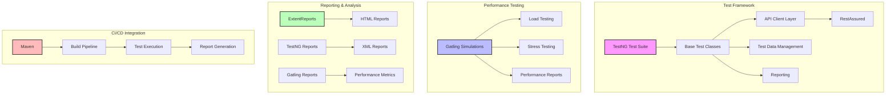
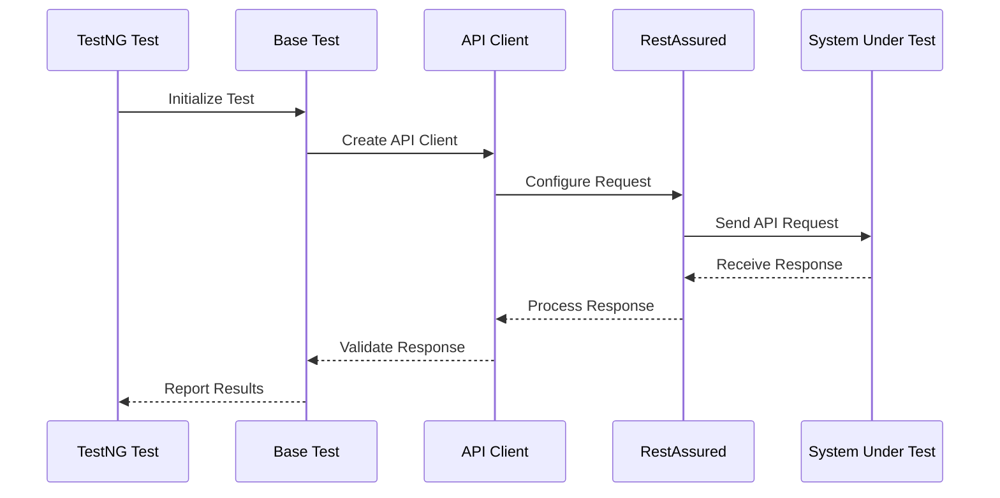
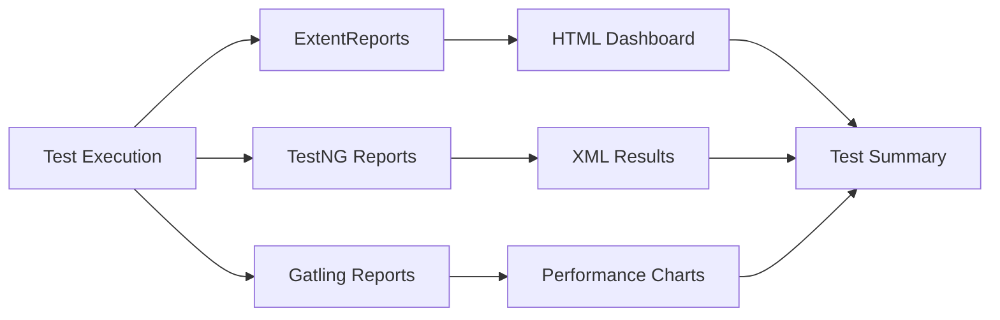

# eReservations API Testing Framework

A robust and scalable API testing framework for the Restful Booker API, built with Java, TestNG, and Gatling.

## 🏗️ Framework Architecture



## 🛠️ Technical Stack

- **Core Framework**: Java 11
- **Testing**: TestNG 7.7.1
- **API Testing**: RestAssured 5.3.0
- **Performance Testing**: Gatling 3.9.5
- **Reporting**: ExtentReports 5.1.1
- **Build Tool**: Maven
- **Logging**: SLF4J 2.0.7
- **JSON Processing**: Jackson 2.15.2

## 📁 Project Structure

```
eReservations/
├── src/
│   ├── main/
│   │   └── java/
│   │       └── com/ereservations/
│   │           ├── api/              # API Client Layer
│   │           │   ├── BaseApiClient.java
│   │           │   ├── BookingApiClient.java
│   │           │   ├── HealthCheckApiClient.java
│   │           │   ├── PingApiClient.java
│   │           │   └── SystemApiClient.java
│   │           └── models/           # Data Models
│   └── test/
│       ├── java/
│       │   └── com/ereservations/
│       │       └── tests/            # Test Classes
│       ├── resources/
│       │   ├── config.properties     # Configuration
│       │   └── test-suites/          # TestNG Suites
│       └── gatling/
│           ├── simulations/          # Gatling Tests
│           └── resources/            # Gatling Resources
├── target/
│   ├── surefire-reports/            # TestNG Reports
│   └── gatling/results/             # Gatling Reports
└── pom.xml                          # Maven Configuration
```

## 🔄 Test Flow Architecture



## 🚀 Key Features

1. **Modular API Client Layer**
   - Base client with common functionality
   - Specialized clients for each API endpoint
   - Automatic authentication handling
   - Response validation and error handling

2. **Comprehensive Testing**
   - Functional API testing
   - Performance testing with Gatling
   - Security testing capabilities
   - Data validation and verification

3. **Advanced Reporting**
   - ExtentReports integration
   - Gatling performance reports
   - TestNG HTML reports
   - Screenshot capture for failures

4. **Configuration Management**
   - Environment-specific configurations
   - Dynamic test data generation
   - Flexible test suite organization

## 🧪 Test Categories

1. **Functional Tests**
   - Basic CRUD operations
   - Input validation
   - Error handling
   - Edge cases

2. **Performance Tests**
   - Load testing
   - Stress testing
   - Endurance testing
   - Spike testing

3. **Security Tests**
   - Authentication
   - Authorization
   - Input validation
   - Error handling

## 📊 Reporting



## 🛠️ Getting Started

1. **Prerequisites**
   - Java 11 or higher
   - Maven 3.6 or higher

2. **Installation**
   ```bash
   git clone git@github.com:yogeshwankhede007/eReservations.git
   cd eReservations
   mvn clean install
   ```

3. **Running Tests**
   ```bash
   # Run all tests
   mvn clean test

   # Run specific test suite
   mvn clean test -DsuiteXmlFile=src/test/resources/test-suites/sanity-suite.xml

   # Run Gatling tests
   mvn clean gatling:test
   ```

## 📈 Performance Metrics

The framework includes comprehensive performance testing capabilities:

- Response time tracking
- Throughput measurement
- Error rate monitoring
- Resource utilization analysis

## 🔒 Security Features

- Secure credential management
- Token-based authentication
- Input sanitization
- Error message handling

## 🤝 Contributing

1. Fork the repository
2. Create your feature branch
3. Commit your changes
4. Push to the branch
5. Create a Pull Request

## 📝 License

This project is licensed under the MIT License - see the [LICENSE](LICENSE) file for details.
