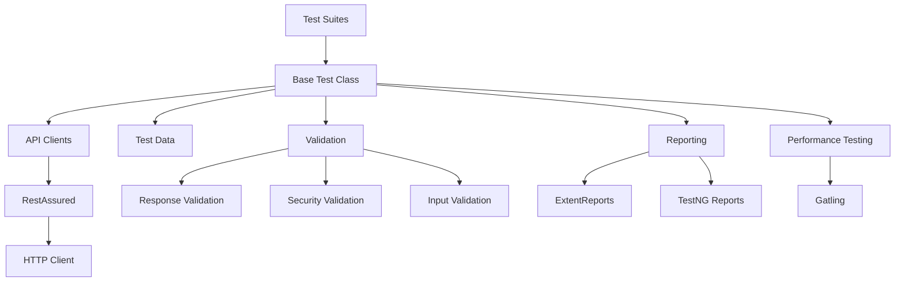
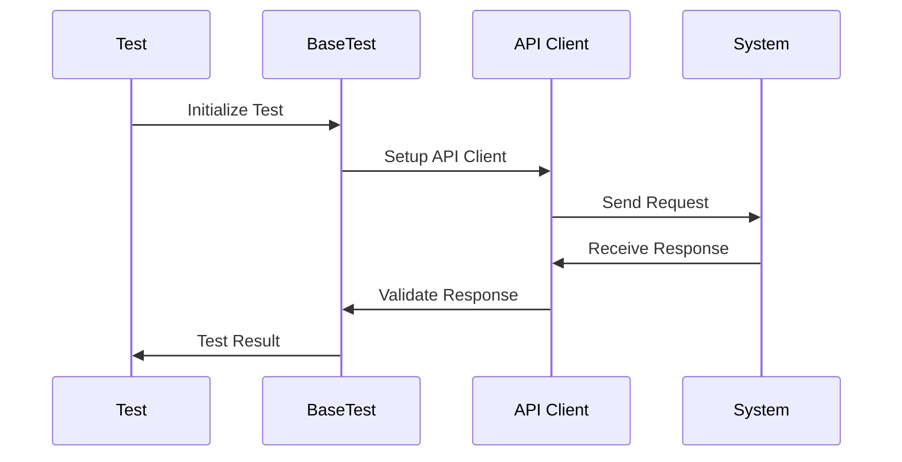
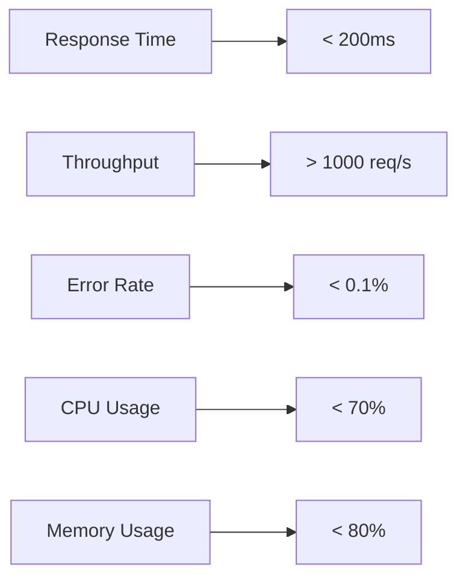

# eReservations API Testing Framework

A robust REST API testing framework for reservation systems. Automates booking flows, authentication, and CRUD operations across multiple environments. Features reporting, test data management, and performance validation for hotel and travel reservation APIs.

## Framework Architecture



## Technical Stack

- **Language**: Java 11
- **Testing Framework**: TestNG
- **API Testing**: RestAssured
- **Performance Testing**: Gatling
- **Reporting**: ExtentReports, TestNG Reports
- **Build Tool**: Maven
- **Logging**: Log4j2
- **JSON Processing**: Jackson
- **Assertions**: TestNG Assertions

## Project Structure

```markdown
eReservations/
├── src/
│   ├── main/
│   │   ├── java/
│   │   │   └── com/ereservations/
│   │   │       ├── api/              # API Client Layer
│   │   │       │   ├── BaseApiClient.java
│   │   │       │   ├── BookingApiClient.java
│   │   │       │   ├── HealthCheckApiClient.java
│   │   │       │   ├── PingApiClient.java
│   │   │       │   └── SystemApiClient.java
│   │   │       └── models/           # Data Models
│   │   └── resources/                # Main Resources
│   └── test/
│       ├── java/
│       │   └── com/ereservations/
│       │       └── tests/            # Test Classes
│       ├── resources/
│       │   ├── config.properties     # Configuration
│       │   ├── chaintest.properties  # ChainTest Config
│       │   └── test-suites/          # TestNG Suites
│       └── gatling/
│           ├── simulations/          # Gatling Tests
│           └── resources/            # Gatling Resources
├── target/
│   ├── surefire-reports/            # TestNG Reports
│   └── gatling/results/             # Gatling Reports
├── scripts/                         # Utility Scripts
├── testng.xml                       # TestNG Configuration
├── pom.xml                          # Maven Configuration
└── README.md                        # Project Documentation
```

## Test Flow Architecture



## Key Features

1. **Modular Architecture**
   - Separate API client layer
   - Reusable test utilities
   - Configurable test suites

2. **Comprehensive Testing**
   - Functional testing
   - Security testing
   - Performance testing
   - Data validation

3. **Reporting**
   - Detailed test reports
   - Performance metrics
   - Test execution logs

4. **Configuration Management**
   - Environment-specific configs
   - Test data management
   - Resource handling

## Test Categories

1. **Basic Functionality**
   - Create booking
   - Get booking
   - Update booking
   - Delete booking

2. **Security Testing**
   - Input validation
   - XSS prevention
   - SQL injection prevention
   - Authentication checks

3. **Performance Testing**
   - Load testing
   - Stress testing
   - Endurance testing

## Reporting

1. **TestNG Reports**
   - Test execution summary
   - Failed test details
   - Test timing information

2. **ExtentReports**
   - Detailed test steps
   - Screenshots
   - Test categorization

3. **Gatling Reports**
   - Response time metrics
   - Request statistics
   - Error rates

## Getting Started

1. Clone the repository
2. Install dependencies: `mvn clean install`
3. Run tests: `mvn test`
4. Generate reports: `mvn surefire-report:report`

## Performance Metrics



## Security Features

1. **Input Validation**
   - Required field checks
   - Data type validation
   - Length restrictions

2. **Security Headers**
   - X-Content-Type-Options
   - X-Frame-Options
   - X-XSS-Protection

3. **Authentication**
   - Token validation
   - Session management
   - Role-based access

## Contributing

1. Fork the repository
2. Create a feature branch
3. Commit your changes
4. Push to the branch
5. Create a Pull Request

## License

This project is licensed under the MIT License - see the [LICENSE](LICENSE) file for details.
